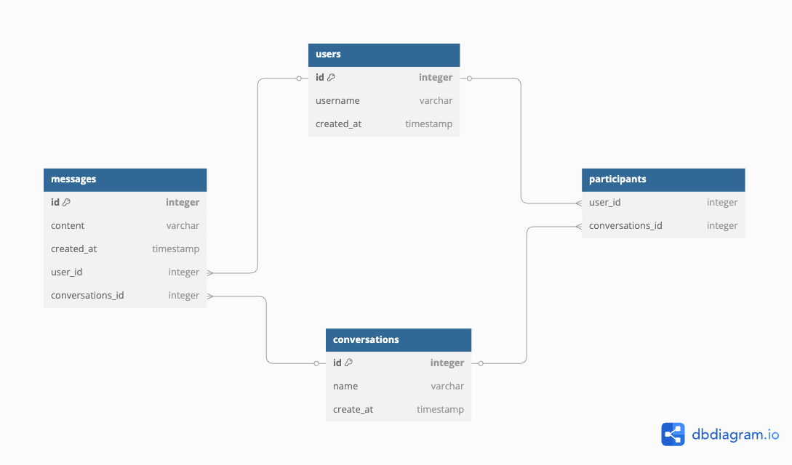
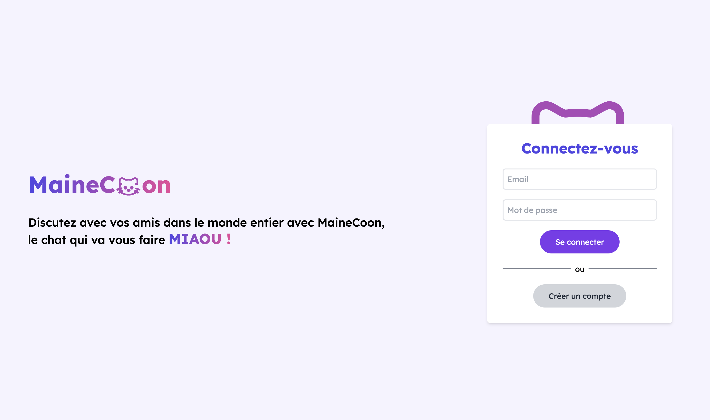

# Projet DevOps - MaineCoon

## Contexte
Ce projet s'inscrit dans le cadre d'un cours de DevOps où nous avons abordé plusieurs technologies et pratiques modernes pour l'automatisation du déploiement et de la gestion d'infrastructure.

Nous avons développé une application de messagerie instantanée afin de déployer celle-ci dans deux environnements distincts : production et pre-production (develop).

## Technologies pour la création de l'application

| Technologie  | Usage |
|---|---|
| Figma | Maquettage |
| React TS + Vite | Réalisation du client web |
| Adonis.js | Réalisation de l'api et du websocket |
| Postgres | Base de données relationnelle |

## Technologies DevOps utilisées

| Technologie  | Usage |
|---|---|
| Docker | Containerisation des services |
| Kubernetes | Orchestration des containers |
| Terraform | Provisioning de l’infrastructure |
| GitHub Actions | Pipeline CI/CD |

L'infrastructure a été provisionnée sur **DigitalOcean**.

## Tâches réalisées

### Partie Dev.

#### > Maquetage
Avant de coder l’interface, nous avons conçu des **maquettes** pour le client web, afin de valider l’expérience utilisateur et le parcours de navigation.

#### > Développement du client web
Le **client web** a ensuite été développé pour permettre aux utilisateurs finaux d’interagir avec l’application. Il consomme directement les endpoints de l’API et offre une interface utilisateur intuitive.

#### > Création de l’API
Nous avons développé une **API REST** permettant aux différents services et au client web de communiquer avec le backend. L’API expose plusieurs endpoints pour gérer les ressources de l’application et un websocket afin de faire dialoguer les utilisateurs en temps réel.

#### > Mise en place des logs sur l’API
Un système de **logging** a été intégré dans l’API afin de tracer les actions importantes (logs d’accès, erreurs, logs applicatifs). Ces logs facilitent le monitoring et le diagnostic en cas d’incident.

Lien maquette : https://www.figma.com/design/vokccttPb6T0FUMQLNf4VX/Untitled?node-id=0-1&t=6vodwVtDxVRsPB5P-1

---

### Partie Ops.

#### > Conteneurisation
Chaque composant de l’application a été **conteneurisé** à l’aide de **Docker**. Un Dockerfile pour le client et pour l'api a été créé afin de garantir la bonne exécution sur n'importe quel environnement.

#### > Mise en place de la base de données
La base de données a été déployée sur **DigitalOcean Managed Databases**. La configuration réseau, les accès, les sauvegardes et la sécurité ont été pris en compte.

#### > Déploiement Kubernetes
L’application conteneurisée a ensuite été déployée dans un cluster **DigitalOcean Kubernetes (DOKS)**. Chaque service dispose de son propre déploiement et service.

#### > Mise en place d’un runner GitHub
Pour exécuter certaines tâches lourdes (ex : déploiement, tests end-to-end), un **runner auto-hébergé** a été configuré. Cela permet de maîtriser l’environnement d’exécution et d’assurer une meilleure intégration avec notre infrastructure.

#### > Pipeline Terraform
L’ensemble de l’infrastructure a été défini dans des fichiers **Terraform**. Un **pipeline CI/CD** a été mis en place pour appliquer ces configurations automatiquement à chaque mise à jour et garantir le déploiement de l'image sur le cluster.

#### > Pipeline Docker
Un pipeline de **build et de push** des images Docker a été mis en place. À chaque modification du code, l’image est automatiquement reconstruite puis poussée dans un **registre Docker** (Docker Hub).

#### > Gestion du tf.state
Le **state Terraform** est stocké dans un espace de stockage DigitalOcean. Cela garantit la persistance et la centralisation de l’état, facilitant le travail en équipe et évitant les conflits.

## Schéma de données

## Rendu de l'application

